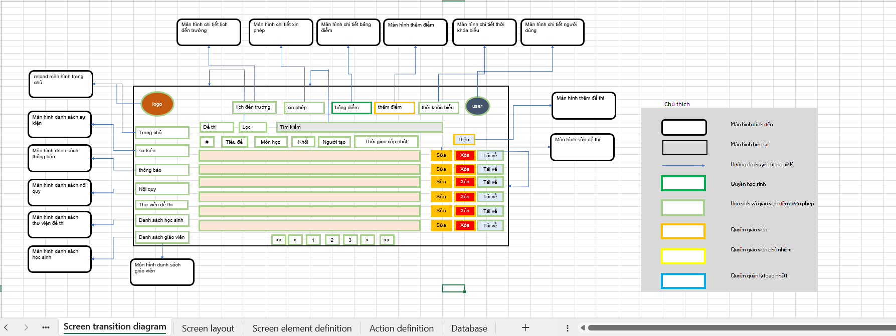
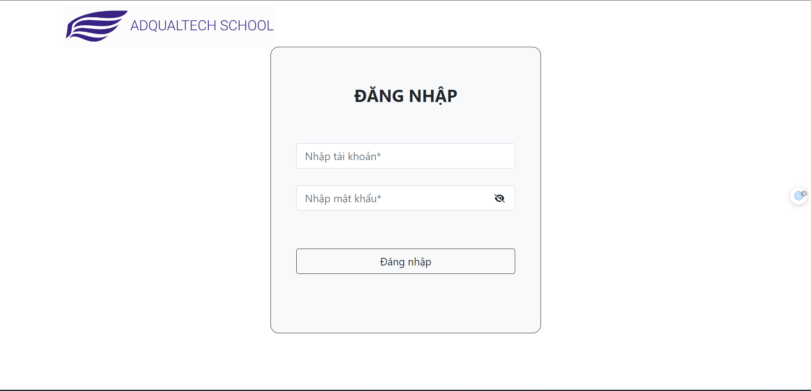
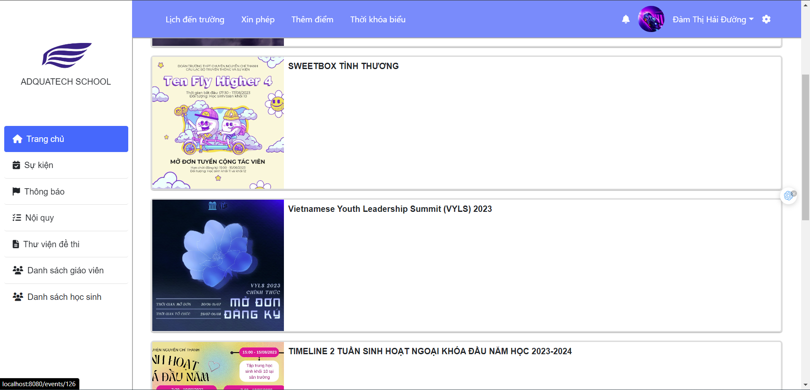
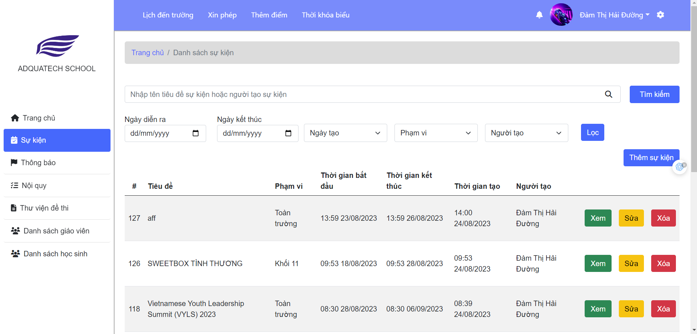
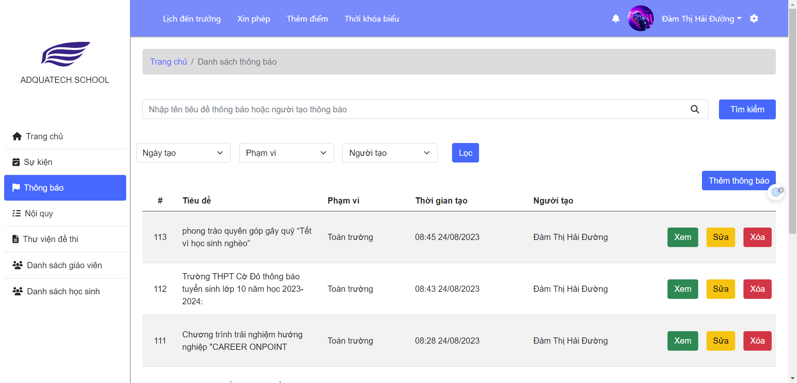
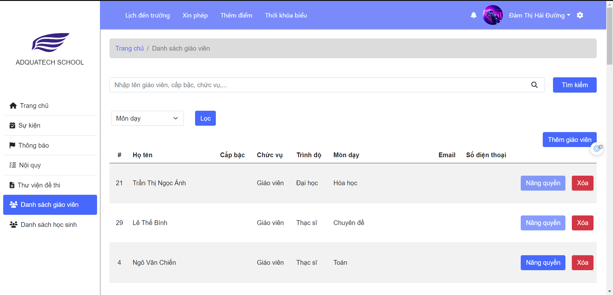
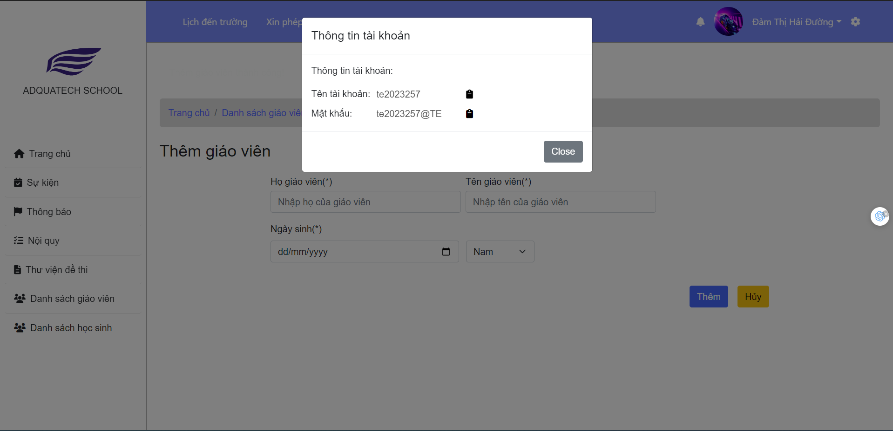
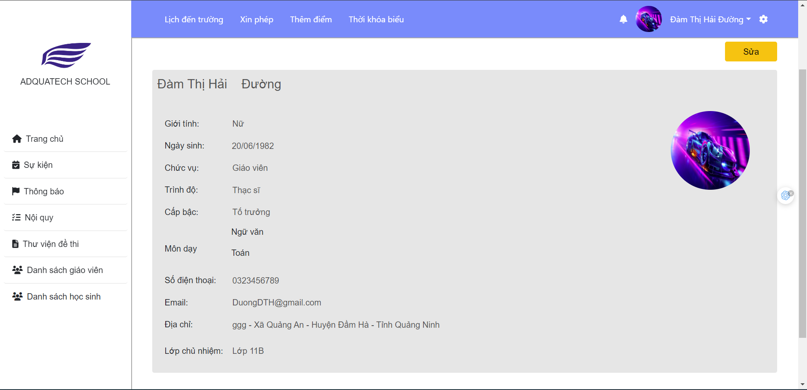

# Adqualtech-school

## Feature
- Pupil can access and get information about upcoming event, notify, and also get rule from school, grade or class that pupil study in. Besides that, they can get preparation exercise to test,...
- Teacher not has role of pupil but also can create new information for pupil
- Manager can upgrade role of teacher to manager and create new teacher or pupil.

## Technologies and tools
- Backend: Spring Boot, Spring Security, Spring Data JPA
- Frontend: Thymeleaf, HTML, CSS, Bootstrap, jQuery, JavaScript
- Database: MySQL

## Demo SRS

## Demo

